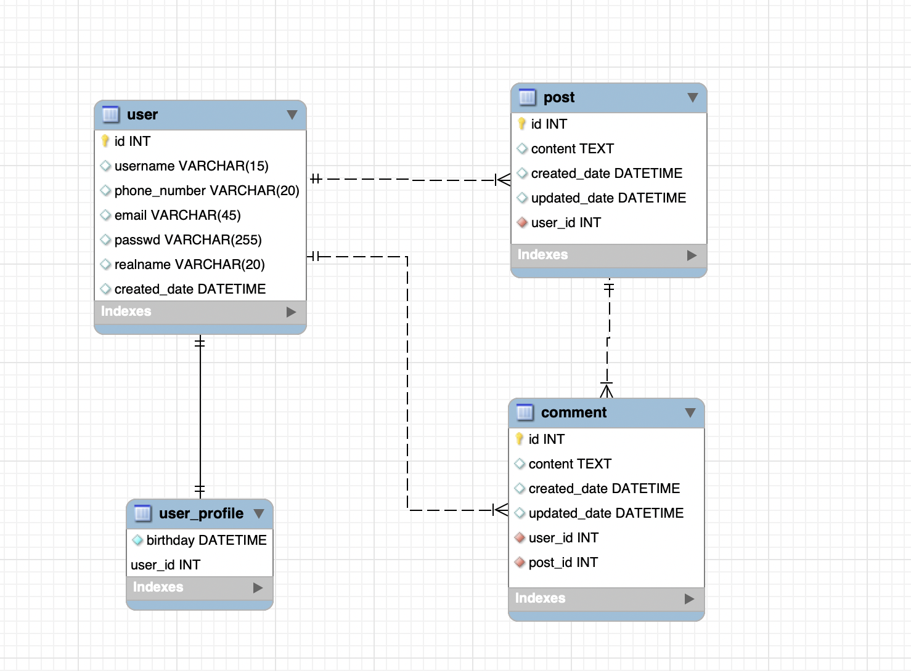

회사에서 나오는 교육지원금으로 패스트캠퍼스에서 [DB 모델링과 서비스 아키텍처 WORKSHOP](https://www.fastcampus.co.kr/dev_camp_dswork/)을 수강하기로 했다. 오늘은 그 첫 강의였다. 강의에서 배운 내용을 정리해 보려고 한다.

## ERD가 왜 필요할까

- 소프트웨어의 본질은 동작과 데이터로 구성된다. 즉, 데이터를 잘 다룬다면 좋은 소프트웨어를 만들 수 있다.
- 사실, 일반인들도 일상적으로 데이터베이스를 사용한다. (엑셀 같은 프로그램이 경량화된 데이터베이스라고 할 수 있다!)
- **ERD**는 개체-관계 다이어그램 Entity-Relationship Diagram 의 약자로, 데이터베이스 테이블 간의 관계를 하나의 그림으로 나타낸 것을 뜻한다.
  - 이를 통하여 만들고 싶은 것을 그려보는 작업(모델링)을 쉽게 수행할 수 있고, 또 우리가 만들고자 하는 것이 어떤 것인지를 더 정확하게 알 수 있다.
  - 데이터가 들어있는 테이블보다 ERD를 통해서 훨씬 명확하게 파악이 가능.
  - ERD 자체가 쉽다.
    - MySQL 무료 툴인 workbench로 쉽게 사용이 가능하고 손으로 쓱쓱 그릴 수도 있음.

## 데이터 무결성

- 컴퓨팅 분야에서 완전한 수명주기를 거치며 데이터의 정확성과 일관성을 유지하고 보증하는 것.
  - RDBMS는 무결성을 준수한다.
    - NoSQL에 관계를 생성할 수 있다고 해도 무결성을 보장할 수 없기 때문에 RDBMS라고 부르지 않는다.
- 개체 무결성(Entity integrity): 고유 키(유일 키)의 개념과 관련. 모든 테이블이 기본 키(primary key)를 가져야 하며 기본 키로 선택된 열은 고유하여야 하며 빈 값은 허용치 않음.
- 범위 무결성(Domain integrity): 정의된 범위에서 관계형 데이터베이스의 모든 열이 선언되도록 규정. 같은 범위(컬럼) 안에서는 동일한 type만 들어가야 함.
- 참조 무결성(Referential integrity): 모든 외래 키 값은 두 가지 상태 가운데 하나에만 속함을 규정. 일반적인 상태는 외래 키 값이 데이터베이스의 특정 테이블의 기본 키 값을 참조.

## 외래 키의 4가지 옵션

- RESTRICT
  - 참조값이 있으면 오류를 낸다.
  - 댓글이 있는 기사를 지우려고 한다면, 댓글부터 삭제한 후 기사를 삭제할 수 있다.
- CASCADE
  - 부모 데이터를 삭제하면 자식 데이터도 동시에 삭제된다.
  - 댓글 있는 기사를 지우려고 하면, 댓글이 차례대로 지워진다.
- SET NULL
  - 자식 데이터의 컬럼은 null로 처리된다.
- NO ACTION
  - 부모 데이터가 삭제되더라도 연결된 자식 데이터에는 아무 영향이 없다. MySQL에서 기본값은 NO ACTION이나, RESTRICT와 동일.

## ERD 본격 실습

MySQL Workbench --- Models 에서 ERD를 그려볼 수 있다.

페이스북 같은 SNS 서비스의 모델링을 해보기로 결정.

방식은 사용자 입장에서 서비스를 사용한다고 생각하고, 그 여정을 따라가는 것으로. 이렇게 하면 쉽게 놓치지 않는다.

- 테이블 생성
- 컬럼 추가
- 다른 테이블과의 관계를 생성 (1:n, 1:1, identifying 1:n, identifying 1:1...)
  - 연결선이 점선인 경우, 참조된 값이 왜래 키 (non-identifying)
  - 연결선이 실선인 경우, 참조된 값이 PK (identifying)
    - IR(Identifying Relationship): 한 테이블에서 PK가 다른 테이블에서도 PK인 경우
      - 하부 정보와의 관계라고 생각할 수 있다.
      - e.g. 필요 개인정보만 입력하는 users 테이블과, 부수적인 보조정보를 입력하는 user_profile 테이블

## Tips

- 전화번호 저장 시 type은 VARCHAR인 것이 좋다. 국제전화 등 길이를 알 수 없는 경우도 있고, 0으로 시작하기 때문.
- User라는 테이블에서 PK를 별도의 id로 할 것인지, 아니면 username으로 할 것인지 등은 기획과도 연관이 많은 문제.
- 생성일 등 날짜와 관련한 속성은 타임 존 때문에, DATETIME보다 TIMESTAMP가 더 유용할 때가 있다.
  - 입력한 장소와 조회하는 장소가 다를 경우, 시간을 보여줄 때 연산이 너무 많이 필요할 수 있다.
  - 페이스북, 트위터 등이 1분 전, 1시간 전, 어제, 1년 전 등과 같은 방식으로 피드를 보여주는 데는 이런 이유가 있다.
