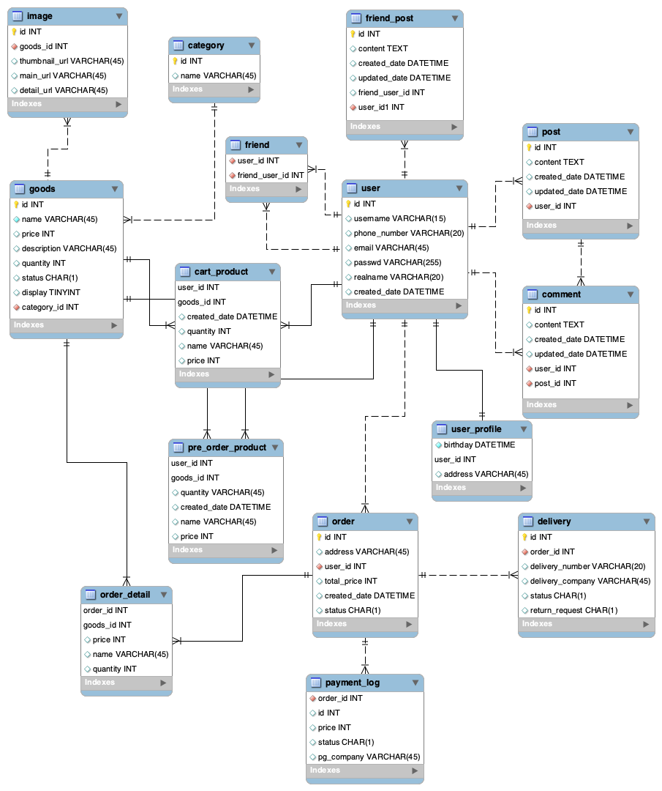

쇼핑몰 기능이 있는 SNS 서비스를 만든다는 가정 하에 ERD를 그려보았다. 지난 시간에 이어서 친구 기능, 상품 및 주문 기능 등을 추가로 붙였다.

데이터베이스를 거의 모르고 이 수업을 듣기 시작했는데, 실용적인 팁과 실무적인 지식은 물론이고 데이터베이스에 대한 흥미와 재미까지 생기는 중이다. 컴퓨터공학이나 백엔드를 공부해보지 않고 개발자로 취업한 사람에게 아주 적합한 강의라는 생각이 든다. 가장 재밌게 배운 내용 한 가지를 정리해 본다.

## SNS에서의 친구 관계 표현하기

페이스북에서의 친구 관계를 DB에서 어떻게 나타낼 수 있을까? 데이터베이스 기본지식이 없는 내가 가장 먼저 생각한 방식은 **1. `user_id`가 친구를 맺은 복수의 user_id를 배열로 저장** 하는 것이었다. 이런 식으로 말이다.

| user_id | friend_user_ids |
| ------- | --------------- |
| 1       | [14, 15]        |
| 13      | [15, 20]        |
| 14      | [1, 15]         |
| 15      | [1, 13, 14, 20] |
| 20      | [13, 15]        |

정답은 **땡!**. 관계형 데이터베이스에서는 테이블 셀에 복합적인 값을 포함할 수가 없다. 한 개의 셀에는 오직 하나의 값만이 들어와야 한다. 흔히 엑셀을 사용했던 기억이나, 객체에서 키/값을 저장할 때와는 다르다.

그렇다면 **2. 친구의 수만큼 컬럼을 생성** 하는 것은 어떨까.

| user_id | friend_user_id_1 | friend_user_id_2 | friend_user_id_3 |
| ------- | ---------------- | ---------------- | ---------------- |
| 1       | 14               | 15               | NULL             |
| 13      | 15               | 20               | NULL             |
| 14      | 1                | 15               | NULL             |
| 15      | 1                | 13               | 14               |
| 20      | 13               | 15               | NULL             |

일단 이 방법도 **땡**이다. 친구가 계속 늘어난다면 컬럼을 계속 생성해야 하는데, 테이블 정의를 도중에 변경하는 것은 바람직하지 않다. 또, '친구' 집합을 관리할 수 없다는 점에서도 관리하기가 어려운 구조다. 그 외에도 친구의 수가 매우 많을 경우 성능 상에 이슈가 발생할 수 있다.

다시 고민해보자. 일단, `user` 테이블과 `friend` 테이블이 있다고 해 보자. `friend` 테이블은 말하자면 `user_id`들과 `user_id`들을 (다대다 관계) 이어주어야 한다. 따라서, **3. 하나의 `user_id` 당 여러 개의 `friend_user_id`를 가지는 일대다 관계**가 형성된다.

| user_id | friend_user_id |
| ------- | -------------- |
| 1       | 14             |
| 1       | 15             |
| 13      | 15             |
| 13      | 20             |
| 14      | 1              |
| 14      | 15             |
| 15      | 1              |
| 15      | 13             |
| 15      | 14             |
| 15      | 20             |
| 20      | 13             |
| 20      | 15             |

이런 식으로 친구 관계를 하나의 테이블로 정리할 수 있다. **딩동댕**!

**4. 서로 상호적으로 두 번씩 관계를 맺지 말고 한 번만 맺었어도 친구라고 인지**할 수도 있지 않을까 하는 생각이 든다. 그러니까 한번만 관계 작대기가 그러졌다면 굳이 또 한번 관계를 적어주어야 할 필요가 있냐는 뜻이다. 위와 같이 친구 관계를 적을 경우 하나의 친구관계를 테이블에 입력하기 위해 2번의 INSERT가 필요하기도 하다.

| user_id | friend_user_id |
| ------- | -------------- |
| 1       | 14             |
| 1       | 15             |
| 13      | 15             |
| 13      | 20             |
| 14      | 15             |
| 15      | 20             |

이 경우는 사실 관계를 찾기 위해 너무도 많은 품이 들어가야만 한다. 가령, id가 15번인 사람의 친구를 찾기 위해서는 `user_id`에서 15를 찾아야 하고, 또 `friend_user_id`에서 15가 적힌 셀을 찾아 그 셀의 user_id를 찾아야 하는 수고를 거쳐야 한다. 조금 쉬운 방법으로는 두 관계를 작은 숫자가 앞에 오도록 하여 복합키로 만들 수도 있겠지만 이 경우도 문자열 검색을 해야 하므로 검색속도가 느릴 가능성이 있다. 그래서 **땡**이다.

데이터베이스를 보고 알 수 있는 점은, 많은 SNS에서 친구 기능과 팔로우 기능이 분리되어 존재한다는 것이다. 팔로우는 한 쪽에서 일방적으로 관계를 맺고 있을 때만 해당하고, 여기서 상대가 수락했을 때에만 친구 관계가 형성된다. 데이터 상 어쩔 수 없는 일인 것이다.

한편, INSERT가 두 번 일어나기는 하지만 데이터가 중복되는 것은 사실 큰 문제가 아니다.
