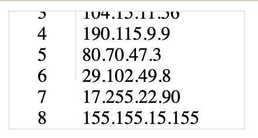
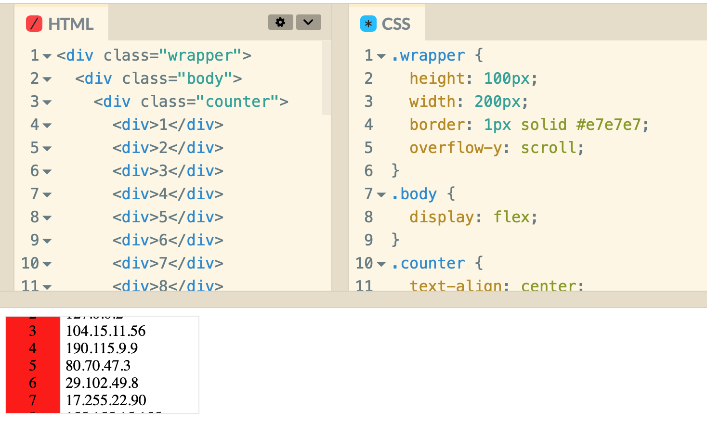

scrollable한 표를 만들었는데, 부모 높이를 벗어나는 자식 요소 부분에 border와 background-color가 적용이 안되는 문제가 있었다.

https://codepen.io/tinystone/pen/GRzQdMQ

문제 원인을 찾지 못해서 헤매다가 태곤님의 도움으로 문제를 해결했다. 원인은 부모(body)가 flex일 때 align-items 속성은 기본값으로 normal로 지정되는데, 이때 align-items는 stretch와 동일하게 동작하게 된다. 자식 요소가 부모보다 작으면 부모의 높이를 채우도록 늘어나는데, 반대로 자식 요소가 부모보다 큰 경우에는 부모 높이만큼까지만 증가한다. 즉, 자식(counter)에 height를 100% 준 것과 동일하게 동작하는 셈이다.

body 요소에 align-items 값을 normal 혹은 stretch가 아닌 그 어떤 값(flex-start, baseline...)을 주면 문제가 해결되는 것을 볼 수 있다.

body 바깥에 div를 하나 더 추가하고, 가장 바깥 요소에 크기와 관련한 속성을 모두 옮기고, body에는 flex 속성만 두는 것으로 문제를 해결할 수 있다.

https://codepen.io/tinystone/pen/KKJQLQz